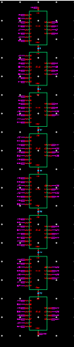
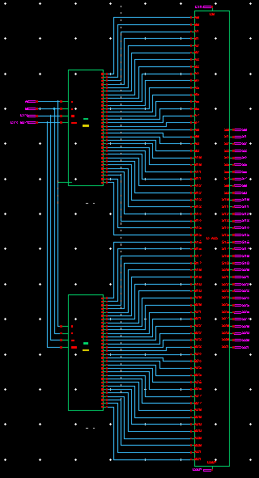
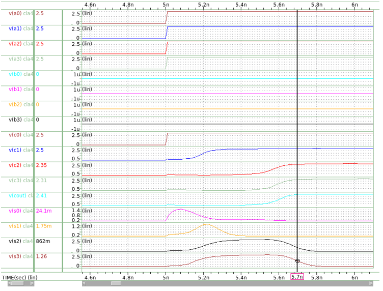
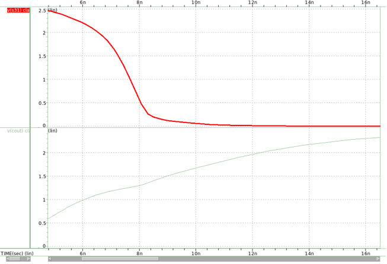

# 32-bit Carry Lookahead Adder (VLSI Design)

> VLSI Project | CMOS Design | Tanner EDA | High-Speed Arithmetic Circuits

---

## Overview
Designed and implemented a 32-bit Carry Lookahead Adder (CLA) using a 250nm CMOS process. The project focuses on improving addition speed by reducing carry propagation delay compared to ripple-carry adders.

---

## Key Concepts
- Carry Lookahead Logic (Generate & Propagate)
- Parallel carry computation
- CMOS circuit design
- Transmission gate logic

---

## Architecture

- 4-bit CLA building block  
- 32-bit CLA using 8 cascaded 4-bit modules  
- Integrated 16-bit and 32-bit SIPO shift registers  
- Transmission gate-based logic  

---

## Design & Simulation

### CLA Schematic

### Final 32-bit Design

### Simulation Waveform

---

## Tools Used
- Tanner EDA  
- HSPICE  
- CMOS 250nm process  

---

## Results

| Component | Delay | Power |
|----------|------|------|
| 4-bit CLA | ~590 ps | ~1.85 mW |
| 32-bit CLA | ~2.93 ns | ~16.6 mW |
| 16-bit SIPO | ~1.8 ns | ~6 mW |

---

This project demonstrates high-speed arithmetic circuit design for performance-critical digital systems such as ALUs and processors.
The design achieved a delay of ~2.93 ns for the 32-bit CLA with improved propagation using buffering techniques.

## Key Contributions
- Designed a 32-bit Carry Lookahead Adder using hierarchical 4-bit CLA blocks  
- Implemented CMOS-based transmission gate logic for efficient design  
- Integrated SIPO shift register to reduce I/O pin requirements  
- Optimized delay using buffering and critical path improvements  
- Hierarchical hardware design  

---

